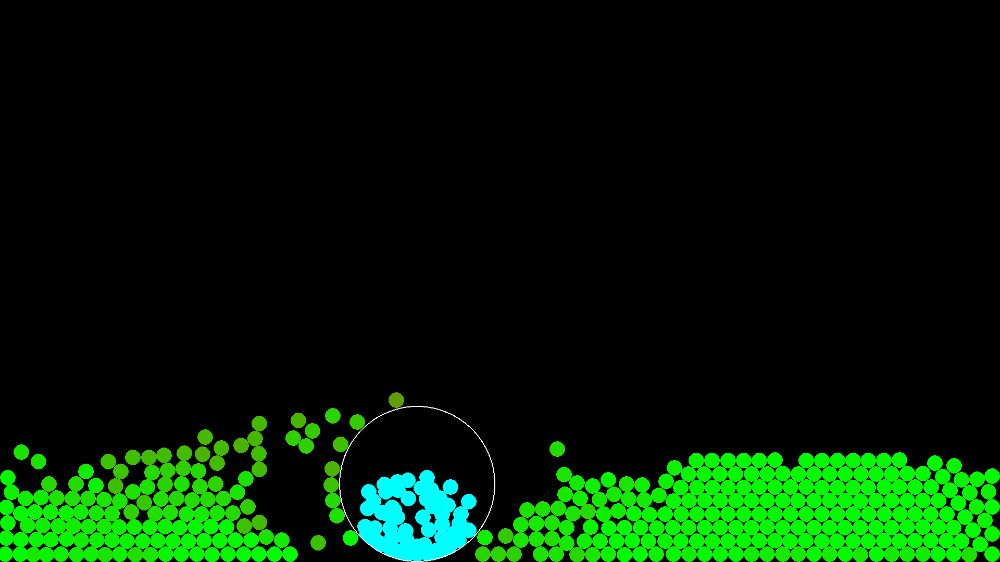

# 2D Ball Simulation

This project is a 2D ball simulation built using Python 3.11 and Pygame. It simulates a set of ball particles with gravity, collision detection and resolution, interactive ball throwing, and a special container mode that captures balls. The simulation demonstrates advanced physics interactions and user interactivity.

## Features

- **Physics Integration**
  - **Gravity & Damping:** Each ball is affected by Earth-like gravity. Global damping simulates energy loss.
  - **Velocity Clamping:** Normal balls have a maximum velocity cap, while thrown balls use a higher cap to preserve momentum.

- **Collision Detection & Resolution**
  - **Grid-Based Solver:** The simulation uses a fixed grid (80×80 pixels) to efficiently detect and resolve collisions among free balls.
  - **Separate Solvers:**  
    - `solve_free_constraints(objects)`: Handles collisions among free balls (and between free balls and the container).  
    - `solve_contained_collisions(contained_objects, container)`: Resolves collisions among balls captured by the container and enforces that they remain within the container’s interior.
  - **Global Special-Object Check:** Ensures free balls are repelled from the container (or held ball) even if they are not in the same grid cell.

- **Ball Size Transitions & Throwing**
  - **Held Ball Mode:** When a ball is picked up (via left-click), it grows gradually from its normal size to an enlarged size over 1 second.
  - **Release Transition:** On release, the ball shrinks smoothly back to its normal size over 3 seconds. The ball’s size at the moment of release is stored so that the interpolation starts from that size.
  - **Throwing Mechanism:** The simulation calculates the average mouse velocity over the last 0.5 seconds. On release (both for held balls and for container mode), this velocity is multiplied by a configurable throw multiplier (up to 8.0) and applied to the ball.

- **Container Mode (Right-Click)**
  - **Capturing Balls:** Right-click creates a container at the mouse position. Only balls whose centers are inside the container are captured.
  - **Contained Ball Behavior:** Captured (cyan) balls are assigned a random initial offset within the container and then “slosh around” inside the container:
    - Their offset is updated each frame with a small random jitter.
    - A spring-like effect (using a threshold and scale factor) pulls their offset inward if it becomes too large, ensuring they remain fully inside the container.
  - **Collision Separation:** Contained balls are excluded from the normal free-ball collision solver and are processed separately, allowing them to collide only with one another and stay inside the container.
  - **Container Release:** On release, contained balls are thrown with the computed mouse velocity, and if they were enlarged, they gradually shrink to their normal size.

- **Dynamic Ball Management & Display**
  - **Adding/Removing Balls:** Functions allow adding additional non-overlapping balls at the top of the screen and removing balls.
  - **Fullscreen Toggle:** Press F11 to toggle full-screen mode. Balls outside the new dimensions are repositioned.
  - **Global Variables & Initialization:** The display surface is set up in the global variable `screen` for easy access throughout the simulation.

## How to Run

1. **Requirements:**  
   - Python 3.11  
   - Pygame

2. **Installation:**  
   Install Pygame via pip if you haven't already:  
   `pip install pygame`

3. **Running the Simulation:**  
   - Copy the simulation code into a file (e.g., `balls.py`).
   - Run the simulation with:  
     `python balls.py`

## Controls

- **Left-Click:**  
  Pick up a ball (it will grow in size). Release to throw it based on your mouse movement.

- **Right-Click:**  
  Create a container at the mouse position. All balls with centers inside the container become captured (displayed in cyan) and will slosh around inside it. Release the right-click to throw the contained balls.

- **Space:**  
  Scatter free balls by applying a random force to each.

- **F11:**  
  Toggle full-screen mode.

- **ESC or Q:**  
  Quit the simulation.

## Code Overview

The code is organized into several key sections:

1. **Configuration Constants:**  
   Defines simulation parameters (e.g., gravity, ball size, damping, grid cell size, etc.) and user-configurable settings (e.g., throw multiplier, container parameters).

2. **Helper Functions:**  
   - `count_touching_neighbors(ball, grid)`: Returns the number of neighboring balls in proximity, used to adjust damping in collisions.

3. **Class Definitions:**
   - **`Ball` Class:**  
     Manages each ball’s position, velocity, size transitions, and collision response.
   - **`Container` Class:**  
     Represents the container that captures balls. It updates its position based on the mouse and enforces boundaries.
   - **`Grid` Class:**  
     Implements spatial partitioning to optimize collision detection.

4. **Collision Solvers:**  
   - **`solve_free_constraints(objects)`**: Handles collisions among free balls (and the container).
   - **`solve_contained_collisions(contained_objects, container)`**: Handles collisions among contained balls and ensures they remain within the container.

5. **Dynamic Ball Management:**  
   Functions for adding, removing, and repositioning balls, as well as toggling full-screen mode.

6. **Main Loop:**  
   The main simulation loop processes events, updates ball states, applies physics (gravity, integration, collision resolution), handles container interactions, and renders everything to the display.

## Final Notes

This simulation demonstrates advanced interactive physics using Pygame. The contained ball mechanism creates a dynamic “sloshing” effect inside the container, and the separation of collision solvers ensures that free and contained balls behave independently. Adjust the configuration constants to fine-tune the behavior.

Enjoy the simulation, and feel free to modify and extend it as needed!

